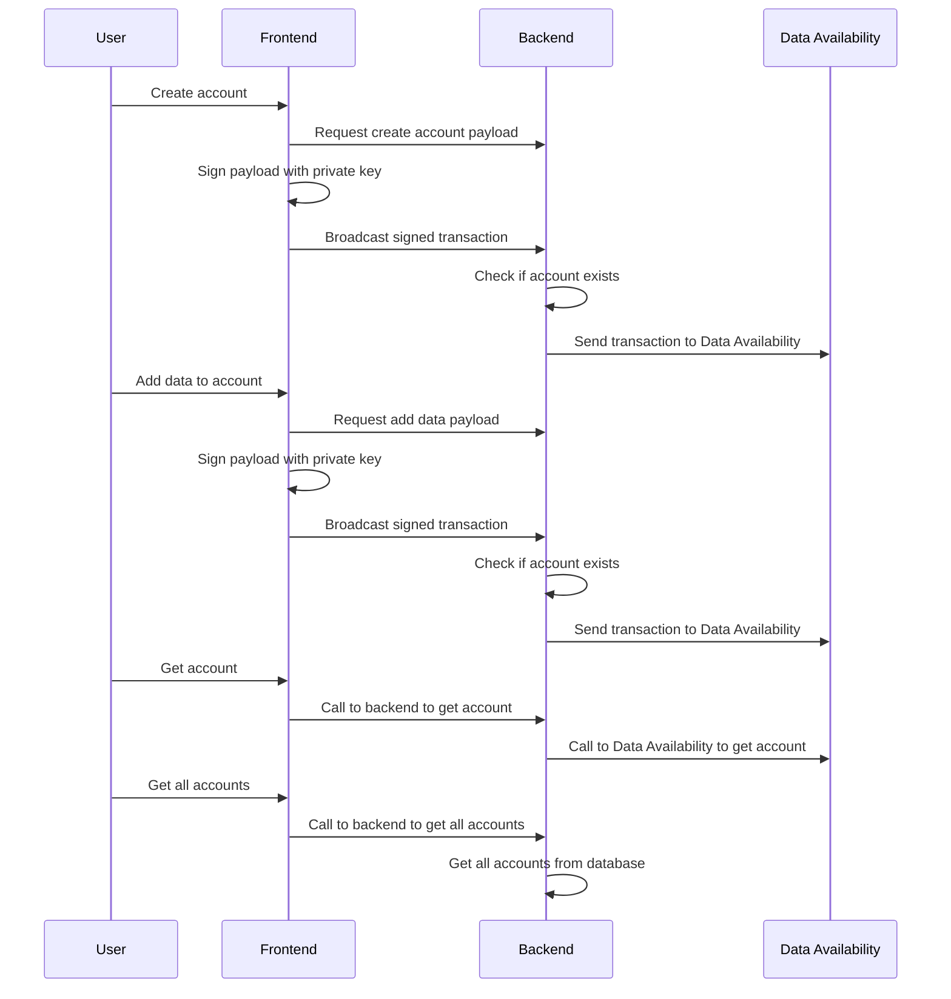

# Submission for the Mammothon 2025

- Demo site: https://mammothon-fe-umber.vercel.app/
- Source code:
  - [Frontend Website](https://github.com/tentou-tech/mammothon-fe)
  - [Backend Service](https://github.com/tentou-tech/prism-be)
- Features:
  - Account creation with wallet address and signature verification
  - Key management for accounts
  - Data storage with signature verification
  - Health check endpoint
- How it works

- Demo Video: https://www.loom.com/share/e860dbd8b9e94ba9abfc37e1b7a6829e?sid=a7091af8-94c8-4a76-a8f1-c4c586e6d6c1

